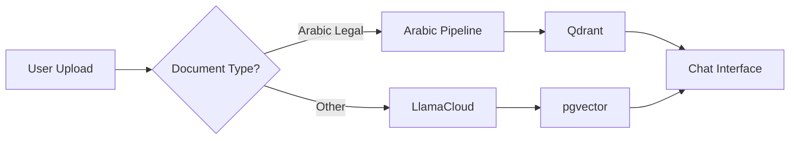

# 🏛️ Arabic Legal RAG Implementation Plan

## 📋 Executive Summary

This document outlines a phased implementation plan for building a comprehensive Arabic Legal RAG system similar to Lovguiden.dk but optimized for Saudi Arabian legal content. The plan prioritizes fixing and optimizing the current system before adding new features.

## 🎯 Project Goals

1. **Primary**: Create a Arabic legal search & chat system for Saudi judicial decisions
2. **Secondary**: Expand to include laws, regulations, and cross-references
3. **Long-term**: Automate updates and provide legal intelligence features

## 📊 Current State Assessment

### What We Have:
- ✅ **SupabaseAuthWithSSR**: Complete frontend with auth, chat UI, document upload
- ✅ **Arabic RAG Pipeline**: 30,000 judicial decisions in Qdrant
- ✅ **Arabic Processing**: 192 legal terms, BGE-M3 embeddings
- ✅ **Two Separate Systems**: Need integration

### What's Missing:
- ❌ Integration between frontend and Arabic pipeline
- ❌ Cross-referencing between decisions and laws
- ❌ Automated updates
- ❌ Laws and regulations data

---

## 🚀 Implementation Phases

### **Phase 0: Fix Current System** (1-2 weeks) 🔧
*Priority: Fix what we have before adding features*

#### 0.1 Document Current State
- [ ] Document the Arabic pipeline architecture
- [ ] Create API specifications for Qdrant integration
- [ ] Map data flow between systems
- [ ] Identify integration points

#### 0.2 Fix SupabaseAuthWithSSR Issues
- [ ] Correct README.md SQL syntax errors
- [ ] Update database schema documentation
- [ ] Fix any deployment issues
- [ ] Test all features end-to-end

#### 0.3 Optimize Arabic Pipeline
- [ ] Review and optimize chunking strategy
- [ ] Validate embedding quality
- [ ] Test retrieval accuracy
- [ ] Document performance metrics

---

### **Phase 1: Basic Integration** (2-3 weeks) 🔌
*Goal: Connect frontend to Arabic pipeline*

#### 1.1 Create Integration API
```typescript
// New API endpoints needed
POST /api/arabic/search     // Search decisions
POST /api/arabic/process    // Process Arabic documents
GET  /api/arabic/stats      // Usage statistics
```

#### 1.2 Modify Document Processing Flow


#### 1.3 Update Chat Interface
- [ ] Add Arabic/English toggle
- [ ] Integrate Qdrant search results
- [ ] Handle RTL text display
- [ ] Add Arabic-specific formatting

#### 1.4 Replace Website Search with Arabic Legal Search
*Note: Website search has been disabled in the UI and will be replaced*

**Current State:**
- ✅ Website search option removed from model selection dropdown
- ✅ `/api/websitechat` endpoint preserved for reference
- ✅ WebsiteViewer component preserved for future legal document viewing

**Implementation Plan:**
```typescript
// New API endpoint to replace /api/websitechat
POST /api/arabic-legal-search
{
  "query": "string",
  "filters": {
    "court": "string",
    "date_range": { "from": "date", "to": "date" },
    "legal_area": "string"
  },
  "search_type": "decisions" | "laws" | "hybrid"
}
```

**Tasks:**
- [ ] Create `/api/arabic-legal-search` endpoint
- [ ] Implement Qdrant query integration
- [ ] Add Arabic legal search model type to UI
- [ ] Reuse citation and source display patterns from websitechat
- [ ] Add legal document viewer (reuse WebsiteViewer component)
- [ ] Implement Arabic-specific search filters

**Code Reuse from websitechat:**
- Source citation and integration patterns
- Streaming response handling
- Rate limiting implementation
- Chat history saving with sources
- UI components for source display

---

### **Phase 2: Database Architecture** (3-4 weeks) 💾
*Goal: Add relational structure for cross-references*

#### 2.1 Design Hybrid Schema
```sql
-- Core tables for Arabic legal system
CREATE TABLE arabic_decisions (
    id UUID PRIMARY KEY,
    case_number TEXT UNIQUE,
    court_name TEXT,
    decision_date DATE,
    gregorian_date DATE,
    hijri_date TEXT,
    summary_ar TEXT,
    summary_en TEXT,
    full_text TEXT,
    legal_classification TEXT[],
    qdrant_point_id TEXT -- Link to vector DB
);

CREATE TABLE arabic_laws (
    id UUID PRIMARY KEY,
    law_number TEXT,
    law_name_ar TEXT,
    law_name_en TEXT,
    issue_date DATE,
    effective_date DATE,
    status TEXT, -- 'active', 'amended', 'repealed'
    issuing_authority TEXT
);

CREATE TABLE law_articles (
    id UUID PRIMARY KEY,
    law_id UUID REFERENCES arabic_laws(id),
    article_number TEXT,
    article_text TEXT,
    amendments JSONB
);

CREATE TABLE decision_references (
    id UUID PRIMARY KEY,
    decision_id UUID REFERENCES arabic_decisions(id),
    reference_type TEXT, -- 'cites_law', 'cites_decision', 'interprets'
    referenced_law_id UUID REFERENCES arabic_laws(id),
    referenced_article_id UUID REFERENCES law_articles(id),
    referenced_decision_id UUID REFERENCES arabic_decisions(id),
    context TEXT
);
```

#### 2.2 Migration Strategy
- [ ] Create PostgreSQL schema
- [ ] Build migration scripts
- [ ] Sync existing Qdrant data
- [ ] Validate data integrity

---

### **Phase 3: Enhanced Search** (2-3 weeks) 🔍
*Goal: Implement cross-reference search*

#### 3.1 Hybrid Search Implementation
```python
class ArabicHybridSearch:
    def __init__(self):
        self.qdrant = QdrantClient()
        self.postgres = PostgresClient()
        
    async def search(self, query: str, filters: dict):
        # 1. Semantic search in Qdrant
        vector_results = await self.qdrant.search(
            collection="decisions",
            query_vector=self.encode(query),
            limit=20
        )
        
        # 2. Enhance with relational data
        enhanced_results = []
        for result in vector_results:
            decision = await self.postgres.get_decision(result.id)
            decision['references'] = await self.get_references(result.id)
            decision['cited_by'] = await self.get_citations(result.id)
            enhanced_results.append(decision)
            
        return enhanced_results
```

#### 3.2 Search Features
- [ ] Multi-modal search (semantic + keyword)
- [ ] Filter by court, date, legal area
- [ ] Find similar cases
- [ ] Track legal precedents

---

### **Phase 4: Add Laws & Regulations** (4-6 weeks) 📚
*Goal: Expand beyond decisions*

#### 4.1 Data Collection
- [ ] Identify official law sources
- [ ] Build Arabic web scrapers
- [ ] Parse PDF laws
- [ ] Extract structured data

#### 4.2 Processing Pipeline
```python
# Law processing pipeline
class LawProcessor:
    def process_law(self, law_text: str):
        # 1. Extract metadata
        metadata = self.extract_law_metadata(law_text)
        
        # 2. Split into articles
        articles = self.split_into_articles(law_text)
        
        # 3. Extract cross-references
        references = self.extract_references(law_text)
        
        # 4. Generate embeddings
        embeddings = self.generate_embeddings(articles)
        
        return {
            'metadata': metadata,
            'articles': articles,
            'references': references,
            'embeddings': embeddings
        }
```

#### 4.3 Integration Tasks
- [ ] Store laws in PostgreSQL
- [ ] Index in Qdrant
- [ ] Link to existing decisions
- [ ] Update UI for law search

---

### **Phase 5: Automation & Intelligence** (4-5 weeks) 🤖
*Goal: Daily updates and smart features*

#### 5.1 Automated Updates
```python
# Daily update job
@schedule.daily
async def update_legal_database():
    # 1. Check for new decisions
    new_decisions = await scrape_moj_decisions()
    
    # 2. Check for law amendments
    amendments = await check_law_updates()
    
    # 3. Process and store
    for decision in new_decisions:
        processed = await process_decision(decision)
        await store_decision(processed)
        
    # 4. Update cross-references
    await update_cross_references()
    
    # 5. Send notifications
    await notify_subscribers(new_decisions, amendments)
```

#### 5.2 Smart Features
- [ ] Legal change detection
- [ ] Precedent tracking
- [ ] Conflict identification
- [ ] Trend analysis

---

### **Phase 6: Advanced Features** (Ongoing) ⚡
*Goal: Value-added services*

#### 6.1 Legal Intelligence
- [ ] Case outcome prediction
- [ ] Legal research assistant
- [ ] Document drafting help
- [ ] Citation suggestions

#### 6.2 Visualization
- [ ] Legal timeline views
- [ ] Precedent networks
- [ ] Amendment tracking
- [ ] Statistics dashboard

#### 6.3 Arabic Legal Web Search (Future)
- [ ] Build custom Arabic legal search engine
- [ ] Index Saudi legal websites:
  - https://laws.boe.gov.sa (Bureau of Experts)
  - https://sjp.moj.gov.sa (Ministry of Justice)
  - https://www.bog.gov.sa (Board of Grievances)
  - https://ncar.gov.sa (National Center for Archives)
- [ ] Implement Arabic query optimization
- [ ] Real-time legal news monitoring

---

## 📅 Timeline Summary

| Phase | Duration | Key Deliverable |
|-------|----------|-----------------|
| Phase 0 | 1-2 weeks | Fixed current system |
| Phase 1 | 2-3 weeks | Basic integration working |
| Phase 2 | 3-4 weeks | Relational database ready |
| Phase 3 | 2-3 weeks | Cross-reference search |
| Phase 4 | 4-6 weeks | Laws integrated |
| Phase 5 | 4-5 weeks | Automation running |
| **Total** | **16-23 weeks** | **Full system** |

---

## 🛠️ Technology Stack

### Current Stack (Keep)
- **Frontend**: Next.js + SupabaseAuthWithSSR
- **Vector DB**: Qdrant Cloud
- **Embeddings**: BGE-M3
- **Arabic NLP**: Existing pipeline

### New Additions
- **Relational DB**: PostgreSQL (via Supabase)
- **Queue**: Redis (via Upstash)
- **Scraping**: Playwright/Puppeteer
- **Scheduling**: Cron jobs

---

## 🚨 Risk Mitigation

### Technical Risks
1. **Arabic text complexity**
   - Mitigation: Use proven Arabic NLP libraries
   - Fallback: Manual review for critical content

2. **Data source changes**
   - Mitigation: Flexible scraper architecture
   - Fallback: Multiple data sources

3. **Scale issues**
   - Mitigation: Incremental processing
   - Fallback: Distributed architecture

### Legal Risks
1. **Data accuracy**
   - Mitigation: Source verification
   - Disclaimer: "For reference only"

2. **Update delays**
   - Mitigation: Multiple daily checks
   - Alert: Notify of potential delays

---

## 📊 Success Metrics

### Phase 0-1 Success Criteria
- [ ] All SQL errors fixed
- [ ] Arabic search returning results
- [ ] Chat interface working with Arabic
- [ ] 95%+ uptime

### Phase 2-3 Success Criteria
- [ ] Cross-references working
- [ ] Search accuracy > 90%
- [ ] Response time < 2 seconds
- [ ] User satisfaction > 4/5

### Phase 4-5 Success Criteria
- [ ] 1000+ laws indexed
- [ ] Daily updates running
- [ ] Zero missed updates
- [ ] 10k+ monthly users

---

## 🎯 Next Steps

### Immediate Actions (This Week)
1. Review and approve this plan
2. Set up development environment
3. Begin Phase 0 tasks
4. Create project tracking board

### Resources Needed
- [ ] Arabic legal domain expert
- [ ] Additional Qdrant capacity
- [ ] Supabase Pro plan
- [ ] Development team time

---

## 📝 Notes

- This plan is modular - phases can be adjusted based on priorities
- Each phase builds on the previous one
- Regular reviews recommended every 2 weeks
- User feedback should drive feature prioritization

---

*Last Updated: [Current Date]*
*Version: 1.0* 