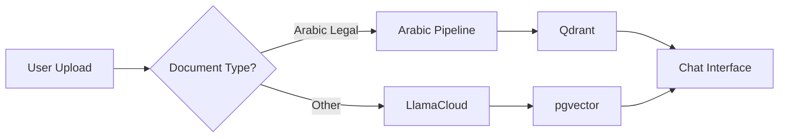

# 🏛️ Arabic Legal RAG Implementation Plan

## 📋 Executive Summary

This document outlines a phased implementation plan for building a comprehensive Arabic Legal RAG system similar to Lovguiden.dk but optimized for Saudi Arabian legal content. The plan prioritizes fixing and optimizing the current system before adding new features.

## 🎯 Project Goals

1. **Primary**: Create a Arabic legal search & chat system for Saudi judicial decisions
2. **Secondary**: Expand to include laws, regulations, and cross-references
3. **Long-term**: Automate updates and provide legal intelligence features

## 📊 Current State Assessment

### What We Have:
- ✅ **SupabaseAuthWithSSR**: Complete frontend with auth, chat UI, document upload
- ✅ **Arabic RAG Pipeline**: 30,000 judicial decisions in Qdrant
- ✅ **Arabic Processing**: 192 legal terms, BGE-M3 embeddings
- ✅ **Two Separate Systems**: Need integration

### What's Missing:
- ❌ Integration between frontend and Arabic pipeline
- ❌ Cross-referencing between decisions and laws
- ❌ Automated updates
- ❌ Laws and regulations data

---

## 🚀 Implementation Phases

### **Phase 0: Landing Page Redesign - Chat-First UX** (1-2 weeks) 🎨
*Priority: Transform landing page to chat interface like Lovguiden.dk*

#### 0.1 UX Analysis & Design
**Inspiration: Lovguiden.dk approach**
- ✅ Main page (`/`) becomes limited chat interface for demos/trials
- ✅ Keep `/chat` as full authenticated experience
- ✅ Top navigation with "Product" menu (4 options including AI-assistant → `/chat`)
- ✅ Guest users can try limited functions and see examples
- ✅ Login integrated into sidebar for upgrade to full features

**Key Design Elements from Lovguiden.dk:**
```
┌─────────────────────────────────────────────────────────┐
│ [☰] Lovguiden.ai  [Produkter ▼] [Om Lovguiden] [Login] │
│                   ┌─────────────────┐                   │
│                   │ • Ny Lovgivning │                   │
│                   │ • Lovsamling    │                   │
│                   │ • Domme & Afgør │                   │
│                   │ • AI-assistent  │ ← Goes to /chat   │
│                   └─────────────────┘                   │
├─────────────────────────────────────────────────────────┤
│ ┌─────────────────┐ ┌─────────────────────────────────┐ │
│ │ + Start ny chat │ │                                 │ │
│ │ ═══════════════ │ │   Limited Chat Interface       │ │
│ │ Example Chats:  │ │   (Guest/Trial Mode)            │ │
│ │ • Sample 1      │ │                                 │ │
│ │ • Sample 2      │ │   "Try limited features..."     │ │
│ │ ─────────────── │ │                                 │ │
│ │ [🔑 Log ind]    │ │   [Limited Input + Examples]    │ │
│ │ [Opret konto]   │ │                                 │ │
│ └─────────────────┘ └─────────────────────────────────┘ │
└─────────────────────────────────────────────────────────┘
```

#### 0.2 Implementation Plan

**Step 1: Modify Root Route (`/`) - Limited Trial Interface**
```typescript
// app/page.tsx - Limited chat interface for trials
export default async function HomePage() {
  const session = await getSession();
  
  // Don't redirect authenticated users - let them use trial mode too
  // They can click "AI-assistent" in Product menu to go to full /chat
  
  // Show limited chat interface for everyone
  return <TrialChatInterface session={session} />;
}
```

**Step 2: Create Trial Chat Interface**
```typescript
// app/components/TrialChatInterface.tsx
export default function TrialChatInterface({ session }: { session: User | null }) {
  return (
    <div className="flex h-screen">
      {/* Left Sidebar - Enhanced with Login */}
      <div className="w-64 bg-gray-50 border-r">
        <div className="p-4">
          <button className="w-full btn-primary mb-4" disabled>
            + Start new chat
          </button>
          
          {/* Login/Upgrade Section - Top of Sidebar */}
          {!session ? (
            <div className="mb-6 p-3 bg-white rounded-lg border">
              <h3 className="font-semibold mb-2">Get Started</h3>
              <p className="text-sm text-gray-600 mb-3">
                Login for full features and unlimited chats
              </p>
              <Link href="/signin" className="block w-full btn-primary mb-2">
                🔑 Log in
              </Link>
              <Link href="/signup" className="block w-full btn-outline">
                Create Account
              </Link>
            </div>
          ) : (
            <div className="mb-6 p-3 bg-blue-50 rounded-lg border border-blue-200">
              <h3 className="font-semibold mb-2">Upgrade to Full Version</h3>
              <p className="text-sm text-gray-600 mb-3">
                You're in trial mode. Access full features in AI-assistant
              </p>
              <Link href="/chat" className="block w-full btn-primary">
                Go to Full Chat →
              </Link>
            </div>
          )}
          
          {/* Sample/Example Chats */}
          <div className="space-y-2">
            <div className="text-sm font-medium text-gray-500">
              {session ? 'Trial Examples' : 'Example Chats'}
            </div>
            <div className="space-y-1">
              {sampleChats.map((chat, i) => (
                <div 
                  key={i} 
                  className="p-2 rounded bg-gray-100 hover:bg-gray-200 cursor-pointer"
                  onClick={() => handleExampleClick(chat)}
                >
                  <div className="text-sm truncate">{chat.title}</div>
                  <div className="text-xs text-gray-500">Try this example</div>
                </div>
              ))}
            </div>
          </div>
          
          {/* Bottom Login (Alternative) */}
          <div className="absolute bottom-4 left-4 right-4">
            <div className="text-center text-sm text-gray-500">
              Need an account?{' '}
              <Link href="/signup" className="text-primary">Sign up</Link>
            </div>
          </div>
        </div>
      </div>
      
      {/* Main Chat Area */}
      <div className="flex-1 flex flex-col">
        <GuestChatMain />
      </div>
    </div>
  );
}
```

**Step 3: Trial Chat Main Area**
```typescript
// app/components/TrialChatMain.tsx
export default function TrialChatMain({ session }: { session: User | null }) {
  return (
    <div className="flex-1 flex flex-col items-center justify-center p-8">
      <div className="max-w-2xl text-center">
        <h1 className="text-4xl font-bold mb-4">
          Arabic Legal Research Assistant
        </h1>
        <p className="text-xl text-gray-600 mb-4">
          Get answers based on Saudi judicial decisions, laws, and regulations
        </p>
        {!session && (
          <p className="text-lg text-blue-600 mb-8">
            Try our limited demo below, or <Link href="/signin" className="underline">sign in</Link> for full access
          </p>
        )}
        {session && (
          <p className="text-lg text-blue-600 mb-8">
            Trial mode - <Link href="/chat" className="underline font-semibold">Go to full AI-assistant →</Link>
          </p>
        )}
        
        {/* Sample Questions */}
        <div className="grid grid-cols-1 md:grid-cols-2 gap-4 mb-8">
          {sampleQuestions.map((question, i) => (
            <div key={i} className="p-4 border rounded-lg hover:bg-gray-50 cursor-pointer opacity-75">
              <div className="text-sm font-medium">{question.title}</div>
              <div className="text-xs text-gray-500 mt-1">{question.preview}</div>
            </div>
          ))}
        </div>
        
        {/* Input Area (Redirects to /chat like Lovguiden.dk) */}
        <div className="relative">
          <form onSubmit={handleTrialSubmit}>
            <div className="flex items-center space-x-2 p-4 border rounded-lg">
              <input 
                type="text" 
                value={query}
                onChange={(e) => setQuery(e.target.value)}
                placeholder="Ask about Saudi legal matters..."
                className="flex-1 outline-none"
                required
              />
              <button type="submit" className="btn-primary">
                Ask Question →
              </button>
            </div>
          </form>
          
          {/* Smart Behavior Notice */}
          <div className="mt-2 text-center text-sm text-gray-500">
            {session ? (
              <>Will redirect to full AI Assistant with your question</>
            ) : (
              <>Will take you to chat interface - sign in there for full features</>
            )}
          </div>
        </div>

        {/* handleTrialSubmit function */}
        ```typescript
        const handleTrialSubmit = (e: FormEvent) => {
          e.preventDefault();
          if (!query.trim()) return;
          
          // Redirect to /chat with the query (like Lovguiden.dk)
          const params = new URLSearchParams({ q: query });
          router.push(`/chat?${params.toString()}`);
        };
        ```
      </div>
    </div>
  );
}
```

#### 0.3 Preserve Current Landing Page Components
**Option A: Keep as Separate Route**
- Move current landing to `/about` or `/features`
- Useful for marketing/SEO

**Option B: Integrate into Guest Interface**
- Add features/testimonials below chat interface
- Scrollable content for interested users

#### 0.4 Update Navigation & Routing
```typescript
// Update navigation logic - Add Product dropdown menu
const navigation = [
  { 
    name: 'Product', 
    type: 'dropdown',
    items: [
      { name: 'Legal Documents', href: '/documents' },     // Future: Phase 5
      { name: 'Law Collection', href: '/laws' },           // Future: Phase 5  
      { name: 'Decisions & Rulings', href: '/decisions' }, // Future: Phase 4
      { name: 'AI Assistant', href: '/chat' },             // Current: Full chat
    ]
  },
  { name: 'About', href: '/about' },  // Moved landing content
  { name: 'Sign In', href: '/signin' },
];

// Update middleware for new flow
if (currentRoute === '/' && !session) {
  // Allow access to trial chat interface
  // Don't redirect to signin
}

// Smart /chat handling - allow guests with queries, but show upgrade prompts
if (currentRoute.startsWith('/chat') && !session) {
  const url = new URL(request.url);
  const hasQuery = url.searchParams.has('q');
  
  if (hasQuery) {
    // Allow guest access when they have a query (from main page)
    // /chat will show the query result + prominent login prompts
    return response;
  } else {
    // Direct /chat access without query requires login
    const redirectUrl = new URL(request.url);
    redirectUrl.pathname = '/signin';
    return NextResponse.redirect(redirectUrl);
  }
}
```

#### 0.5 Implementation Tasks

**Main Page (/) - Trial Interface:**
- [ ] Create `TrialChatInterface` component
- [ ] Create `TrialChatMain` component  
- [ ] Update root route (`/`) logic for trial mode
- [ ] Add sample questions/chats data with click handlers
- [ ] Style login/upgrade sections in sidebar
- [ ] Implement query redirect to `/chat?q=query`

**Chat Page (/chat) - Smart Guest Handling:**
- [ ] Modify `/chat` to accept guests with queries (`?q=query`)
- [ ] Show guest banner: "Sign in for unlimited chats, history, and advanced features"
- [ ] Allow 1 guest query, then require login for more
- [ ] Pre-populate chat input with query from URL parameter
- [ ] Add prominent "Sign In" and "Sign Up" buttons in sidebar for guests

**Navigation & Routing:**
- [ ] Add Product dropdown menu to navigation
- [ ] Create placeholder routes for future features (/documents, /laws, /decisions)
- [ ] Update middleware for smart `/chat` guest access
- [ ] Move current landing to `/about`
- [ ] Test modal routes with new flow

**Testing:**
- [ ] Test guest flow: Main page → type query → redirects to /chat → shows result → prompts login
- [ ] Test authenticated flow: Main page → type query → redirects to /chat → full experience
- [ ] Test direct /chat access (should require login)
- [ ] Test /chat?q=something access (should allow guests)

#### 0.6 Benefits of This Approach
✅ **Immediate Value**: Users see the app instantly
✅ **Lower Friction**: No marketing page barrier
✅ **Clear CTA**: Login prompts are contextual
✅ **Modern UX**: Follows successful apps like Lovguiden.dk
✅ **Engagement**: Users understand the product immediately

---

### **Phase 1: Fix Current System** (1-2 weeks) 🔧
*Priority: Fix what we have before adding features*

#### 1.1 Document Current State
- [ ] Document the Arabic pipeline architecture
- [ ] Create API specifications for Qdrant integration
- [ ] Map data flow between systems
- [ ] Identify integration points

#### 1.2 Fix SupabaseAuthWithSSR Issues
- [ ] Correct README.md SQL syntax errors
- [ ] Update database schema documentation
- [ ] Fix any deployment issues
- [ ] Test all features end-to-end

#### 1.3 Optimize Arabic Pipeline
- [ ] Review and optimize chunking strategy
- [ ] Validate embedding quality
- [ ] Test retrieval accuracy
- [ ] Document performance metrics

---

### **Phase 2: Basic Integration** (2-3 weeks) 🔌
*Goal: Connect frontend to Arabic pipeline*

#### 2.1 Create Integration API
```typescript
// New API endpoints needed
POST /api/arabic/search     // Search decisions
POST /api/arabic/process    // Process Arabic documents
GET  /api/arabic/stats      // Usage statistics
```

#### 2.2 Modify Document Processing Flow


#### 2.3 Update Chat Interface
- [ ] Add Arabic/English toggle
- [ ] Integrate Qdrant search results
- [ ] Handle RTL text display
- [ ] Add Arabic-specific formatting
- [ ] **Integrate Q&A functionality** (see Q&A Integration section below)

#### 2.4 Replace Website Search with Arabic Legal Search
*Note: Website search has been disabled in the UI and will be replaced*

**Current State:**
- ✅ Website search option removed from model selection dropdown
- ✅ `/api/websitechat` endpoint preserved for reference
- ✅ WebsiteViewer component preserved for future legal document viewing

**Implementation Plan:**
```typescript
// New API endpoint to replace /api/websitechat
POST /api/arabic-legal-search
{
  "query": "string",
  "filters": {
    "court": "string",
    "date_range": { "from": "date", "to": "date" },
    "legal_area": "string"
  },
  "search_type": "decisions" | "laws" | "hybrid"
}
```

**Tasks:**
- [ ] Create `/api/arabic-legal-search` endpoint
- [ ] Implement Qdrant query integration
- [ ] Add Arabic legal search model type to UI
- [ ] Reuse citation and source display patterns from websitechat
- [ ] Add legal document viewer (reuse WebsiteViewer component)
- [ ] Implement Arabic-specific search filters

**Code Reuse from websitechat:**
- Source citation and integration patterns
- Streaming response handling
- Rate limiting implementation
- Chat history saving with sources
- UI components for source display

---

### **Phase 2.5: Q&A Integration** (1-2 weeks) 🤖
*Goal: Leverage generated Q&A pairs for enhanced user experience*

The Arabic legal pipeline generates 3 Q&A pairs per decision by default. These can be integrated into the web application in multiple valuable ways:

#### 2.5.1 Query Suggestion System
```typescript
// Real-time query suggestions based on Q&A pairs
export function useQuerySuggestions(inputValue: string) {
  const [suggestions, setSuggestions] = useState<string[]>([]);
  
  useEffect(() => {
    if (inputValue.length > 10) {
      fetch('/api/qa-suggestions', {
        method: 'POST',
        body: JSON.stringify({ query: inputValue })
      })
      .then(res => res.json())
      .then(setSuggestions);
    }
  }, [inputValue]);
  
  return suggestions;
}
```

**Implementation Tasks:**
- [ ] Create `/api/qa-suggestions` endpoint
- [ ] Implement semantic search over Q&A questions
- [ ] Add suggestion dropdown to chat input
- [ ] Style suggestions with difficulty/type badges

#### 2.5.2 Enhanced Search Results with Q&A Context
```typescript
// Show related Q&A pairs alongside search results
interface SearchResultWithQA {
  content: string;
  metadata: any;
  score: number;
  relatedQA: {
    question: string;
    answer: string;
    difficulty: 'basic' | 'intermediate' | 'advanced';
    type: 'factual' | 'procedural' | 'legal_principle' | 'case_specific';
  }[];
}
```

**Implementation Tasks:**
- [ ] Modify search API to include Q&A pairs
- [ ] Create expandable Q&A sections in results
- [ ] Add difficulty/type filtering for Q&A
- [ ] Implement Q&A embedding search

#### 2.5.3 Q&A Prompt Quality Assessment
```typescript
// The Q&A quality depends on the prompt in legal_qa_generator.py
// Current prompt may need optimization for practical query suggestions:

// Current approach focuses on educational Q&A types:
// - factual, procedural, legal_principle, case_specific

// For better query suggestions, consider prompts that generate:
// - Natural user queries (كيف، متى، ماذا، لماذا)
// - Practical legal questions lawyers would ask
// - Comparative questions between similar cases
// - Application-focused questions about the decision
```

**Implementation Tasks:**
- [ ] Analyze current Q&A quality from generated pairs
- [ ] Test different prompt variations for query relevance
- [ ] A/B test query suggestions with users
- [ ] Fine-tune prompts based on user feedback
- [ ] Consider prompt variants for different use cases

#### 2.5.4 Chat Context Enhancement
**Use Q&A pairs to provide richer context in chat responses:**
- [ ] Search relevant Q&A pairs for user queries
- [ ] Include Q&A context in LLM prompts
- [ ] Show "Related Questions" section in chat
- [ ] Allow users to click Q&A to explore further

#### 2.5.5 Database Schema for Q&A
```sql
-- Store Q&A pairs with searchable embeddings
CREATE TABLE legal_qa_pairs (
    id UUID PRIMARY KEY DEFAULT gen_random_uuid(),
    decision_id UUID REFERENCES arabic_decisions(id),
    question TEXT NOT NULL,
    answer TEXT NOT NULL,
    difficulty TEXT CHECK (difficulty IN ('basic', 'intermediate', 'advanced')),
    type TEXT CHECK (type IN ('factual', 'procedural', 'legal_principle', 'case_specific')),
    question_embedding vector(1024), -- BGE-M3 embeddings
    answer_embedding vector(1024),
    created_at TIMESTAMP DEFAULT NOW()
);

-- Indexes for efficient Q&A search
CREATE INDEX idx_qa_difficulty ON legal_qa_pairs(difficulty);
CREATE INDEX idx_qa_type ON legal_qa_pairs(type);
CREATE INDEX idx_qa_question_embedding ON legal_qa_pairs 
USING ivfflat (question_embedding vector_cosine_ops);
```

#### 2.5.6 Q&A API Endpoints
- [ ] `POST /api/qa-suggestions` - Get query suggestions
- [ ] `POST /api/qa-context` - Get Q&A for chat context
- [ ] `POST /api/qa-search` - Search Q&A pairs
- [ ] `POST /api/qa-feedback` - Collect user feedback on Q&A quality

#### 2.5.7 UI Components
- [ ] `QuerySuggestions` - Dropdown with suggested questions
- [ ] `QASection` - Expandable Q&A in search results
- [ ] `RelatedQuestions` - Q&A recommendations in chat
- [ ] `QAFeedback` - Component for collecting Q&A quality feedback

**Expected Benefits:**
- 🚀 **Better Discovery**: Users find relevant questions they didn't think to ask
- 🎯 **Improved Accuracy**: Q&A context helps LLM provide better answers
- 💡 **Enhanced Search**: Related Q&A pairs provide additional context
- 🔍 **Smart Suggestions**: AI-generated questions guide user queries

**⚠️ Important Note:**
Q&A quality depends heavily on the prompt in `legal_qa_generator.py`. The current prompt may need optimization for practical query suggestions vs. educational content. Consider testing and iterating on prompts based on user feedback.

---

### **Phase 3: Database Architecture** (3-4 weeks) 💾
*Goal: Add relational structure for cross-references*

#### 3.1 Design Hybrid Schema
```sql
-- Core tables for Arabic legal system
CREATE TABLE arabic_decisions (
    id UUID PRIMARY KEY,
    case_number TEXT UNIQUE,
    court_name TEXT,
    decision_date DATE,
    gregorian_date DATE,
    hijri_date TEXT,
    summary_ar TEXT,
    summary_en TEXT,
    full_text TEXT,
    legal_classification TEXT[],
    qdrant_point_id TEXT -- Link to vector DB
);

CREATE TABLE arabic_laws (
    id UUID PRIMARY KEY,
    law_number TEXT,
    law_name_ar TEXT,
    law_name_en TEXT,
    issue_date DATE,
    effective_date DATE,
    status TEXT, -- 'active', 'amended', 'repealed'
    issuing_authority TEXT
);

CREATE TABLE law_articles (
    id UUID PRIMARY KEY,
    law_id UUID REFERENCES arabic_laws(id),
    article_number TEXT,
    article_text TEXT,
    amendments JSONB
);

CREATE TABLE decision_references (
    id UUID PRIMARY KEY,
    decision_id UUID REFERENCES arabic_decisions(id),
    reference_type TEXT, -- 'cites_law', 'cites_decision', 'interprets'
    referenced_law_id UUID REFERENCES arabic_laws(id),
    referenced_article_id UUID REFERENCES law_articles(id),
    referenced_decision_id UUID REFERENCES arabic_decisions(id),
    context TEXT
);
```

#### 3.2 Migration Strategy
- [ ] Create PostgreSQL schema
- [ ] Build migration scripts
- [ ] Sync existing Qdrant data
- [ ] Validate data integrity

---

### **Phase 4: Enhanced Search** (2-3 weeks) 🔍
*Goal: Implement cross-reference search*

#### 4.1 Hybrid Search Implementation
```python
class ArabicHybridSearch:
    def __init__(self):
        self.qdrant = QdrantClient()
        self.postgres = PostgresClient()
        
    async def search(self, query: str, filters: dict):
        # 1. Semantic search in Qdrant
        vector_results = await self.qdrant.search(
            collection="decisions",
            query_vector=self.encode(query),
            limit=20
        )
        
        # 2. Enhance with relational data
        enhanced_results = []
        for result in vector_results:
            decision = await self.postgres.get_decision(result.id)
            decision['references'] = await self.get_references(result.id)
            decision['cited_by'] = await self.get_citations(result.id)
            enhanced_results.append(decision)
            
        return enhanced_results
```

#### 4.2 Search Features
- [ ] Multi-modal search (semantic + keyword)
- [ ] Filter by court, date, legal area
- [ ] Find similar cases
- [ ] Track legal precedents

---

### **Phase 5: Add Laws & Regulations** (4-6 weeks) 📚
*Goal: Expand beyond decisions*

#### 5.1 Data Collection
- [ ] Identify official law sources
- [ ] Build Arabic web scrapers
- [ ] Parse PDF laws
- [ ] Extract structured data

#### 5.2 Processing Pipeline
```python
# Law processing pipeline
class LawProcessor:
    def process_law(self, law_text: str):
        # 1. Extract metadata
        metadata = self.extract_law_metadata(law_text)
        
        # 2. Split into articles
        articles = self.split_into_articles(law_text)
        
        # 3. Extract cross-references
        references = self.extract_references(law_text)
        
        # 4. Generate embeddings
        embeddings = self.generate_embeddings(articles)
        
        return {
            'metadata': metadata,
            'articles': articles,
            'references': references,
            'embeddings': embeddings
        }
```

#### 5.3 Integration Tasks
- [ ] Store laws in PostgreSQL
- [ ] Index in Qdrant
- [ ] Link to existing decisions
- [ ] Update UI for law search

---

### **Phase 6: Automation & Intelligence** (4-5 weeks) 🤖
*Goal: Daily updates and smart features*

#### 6.1 Automated Updates
```python
# Daily update job
@schedule.daily
async def update_legal_database():
    # 1. Check for new decisions
    new_decisions = await scrape_moj_decisions()
    
    # 2. Check for law amendments
    amendments = await check_law_updates()
    
    # 3. Process and store
    for decision in new_decisions:
        processed = await process_decision(decision)
        await store_decision(processed)
        
    # 4. Update cross-references
    await update_cross_references()
    
    # 5. Send notifications
    await notify_subscribers(new_decisions, amendments)
```

#### 6.2 Smart Features
- [ ] Legal change detection
- [ ] Precedent tracking
- [ ] Conflict identification
- [ ] Trend analysis

---

### **Phase 7: Advanced Features** (Ongoing) ⚡
*Goal: Value-added services*

#### 7.1 Legal Intelligence
- [ ] Case outcome prediction
- [ ] Legal research assistant
- [ ] Document drafting help
- [ ] Citation suggestions

#### 7.2 Visualization
- [ ] Legal timeline views
- [ ] Precedent networks
- [ ] Amendment tracking
- [ ] Statistics dashboard

#### 7.3 Arabic Legal Web Search (Future)
- [ ] Build custom Arabic legal search engine
- [ ] Index Saudi legal websites:
  - https://laws.boe.gov.sa (Bureau of Experts)
  - https://sjp.moj.gov.sa (Ministry of Justice)
  - https://www.bog.gov.sa (Board of Grievances)
  - https://ncar.gov.sa (National Center for Archives)
- [ ] Implement Arabic query optimization
- [ ] Real-time legal news monitoring

---

## 📅 Timeline Summary

| Phase | Duration | Key Deliverable |
|-------|----------|-----------------|
| Phase 0 | 1-2 weeks | Chat-first landing page |
| Phase 1 | 1-2 weeks | Fixed current system |
| Phase 2 | 2-3 weeks | Basic integration working |
| Phase 2.5 | 1-2 weeks | **Q&A integration & learning features** |
| Phase 3 | 3-4 weeks | Relational database ready |
| Phase 4 | 2-3 weeks | Cross-reference search |
| Phase 5 | 4-6 weeks | Laws integrated |
| Phase 6 | 4-5 weeks | Automation running |
| **Total** | **18-27 weeks** | **Full system** |

---

## 🛠️ Technology Stack

### Current Stack (Keep)
- **Frontend**: Next.js + SupabaseAuthWithSSR
- **Vector DB**: Qdrant Cloud
- **Embeddings**: BGE-M3
- **Arabic NLP**: Existing pipeline

### New Additions
- **Relational DB**: PostgreSQL (via Supabase)
- **Queue**: Redis (via Upstash)
- **Scraping**: Playwright/Puppeteer
- **Scheduling**: Cron jobs

---

## 🚨 Risk Mitigation

### Technical Risks
1. **Arabic text complexity**
   - Mitigation: Use proven Arabic NLP libraries
   - Fallback: Manual review for critical content

2. **Data source changes**
   - Mitigation: Flexible scraper architecture
   - Fallback: Multiple data sources

3. **Scale issues**
   - Mitigation: Incremental processing
   - Fallback: Distributed architecture

### Legal Risks
1. **Data accuracy**
   - Mitigation: Source verification
   - Disclaimer: "For reference only"

2. **Update delays**
   - Mitigation: Multiple daily checks
   - Alert: Notify of potential delays

---

## 📊 Success Metrics

### Phase 0-1 Success Criteria
- [ ] All SQL errors fixed
- [ ] Arabic search returning results
- [ ] Chat interface working with Arabic
- [ ] 95%+ uptime

### Phase 2-3 Success Criteria
- [ ] Cross-references working
- [ ] Search accuracy > 90%
- [ ] Response time < 2 seconds
- [ ] User satisfaction > 4/5

### Phase 4-5 Success Criteria
- [ ] 1000+ laws indexed
- [ ] Daily updates running
- [ ] Zero missed updates
- [ ] 10k+ monthly users

---

## 🎯 Next Steps

### Immediate Actions (This Week)
1. Review and approve this plan
2. Set up development environment
3. Begin Phase 0 tasks
4. Create project tracking board

### Resources Needed
- [ ] Arabic legal domain expert
- [ ] Additional Qdrant capacity
- [ ] Supabase Pro plan
- [ ] Development team time

---

## 📝 Notes

- This plan is modular - phases can be adjusted based on priorities
- Each phase builds on the previous one
- Regular reviews recommended every 2 weeks
- User feedback should drive feature prioritization

---

*Last Updated: [Current Date]*
*Version: 1.0* 