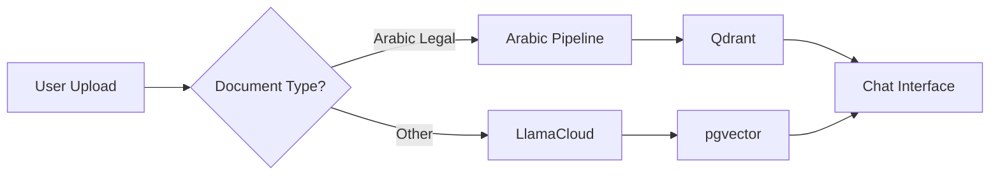

# 🏛️ Arabic Legal RAG Implementation Plan

## 📋 Executive Summary

This document outlines a phased implementation plan for building a comprehensive Arabic Legal RAG system similar to Lovguiden.dk but optimized for Saudi Arabian legal content. The plan prioritizes fixing and optimizing the current system before adding new features.

## 🎯 Project Goals

1. **Primary**: Create a Arabic legal search & chat system for Saudi judicial decisions
2. **Secondary**: Expand to include laws, regulations, and cross-references
3. **Long-term**: Automate updates and provide legal intelligence features

## 📊 Current State Assessment

### What We Have:
- ✅ **SupabaseAuthWithSSR**: Complete frontend with auth, chat UI, document upload
- ✅ **Arabic RAG Pipeline**: 30,000 judicial decisions in Qdrant
- ✅ **Arabic Processing**: 192 legal terms, BGE-M3 embeddings
- ✅ **Two Separate Systems**: Need integration

### What's Missing:
- ❌ Integration between frontend and Arabic pipeline
- ❌ Cross-referencing between decisions and laws
- ❌ Automated updates
- ❌ Laws and regulations data

---

## 🚀 Implementation Phases

### **Phase 0: Landing Page Redesign - Chat-First UX** (1-2 weeks) 🎨
*Priority: Transform landing page to chat interface like Lovguiden.dk*

#### 0.1 UX Analysis & Design
**Inspiration: Lovguiden.dk approach**
- ✅ Main page (`/`) becomes chat interface directly
- ✅ No separate landing page - users see the app immediately  
- ✅ Login integrated into chat sidebar
- ✅ Guest users can see interface but must login to chat

**Key Design Elements from Lovguiden.dk:**
```
┌─────────────────────────────────────────────────────────┐
│ [☰] Lovguiden.ai    [Search Bar]    [Login] [☀️]      │
├─────────────────────────────────────────────────────────┤
│ ┌─────────────────┐ ┌─────────────────────────────────┐ │
│ │ + Start ny chat │ │                                 │ │
│ │ ═══════════════ │ │   Main Chat Interface          │ │
│ │ Chat History:   │ │                                 │ │
│ │ • Chat 1        │ │   "Få svar på baggrund af..."  │ │
│ │ • Chat 2        │ │                                 │ │
│ │ ─────────────── │ │   [Input Field with options]   │ │
│ │ [🔑 Log ind]    │ │                                 │ │
│ │ [Opret konto]   │ │                                 │ │
│ └─────────────────┘ └─────────────────────────────────┘ │
└─────────────────────────────────────────────────────────┘
```

#### 0.2 Implementation Plan

**Step 1: Modify Root Route (`/`)**
```typescript
// app/page.tsx - Transform from landing to chat
export default async function HomePage() {
  const session = await getSession();
  
  if (session) {
    // Redirect authenticated users to chat
    redirect('/chat');
  }
  
  // Show chat interface for guests with login prompts
  return <GuestChatInterface />;
}
```

**Step 2: Create Guest Chat Interface**
```typescript
// app/components/GuestChatInterface.tsx
export default function GuestChatInterface() {
  return (
    <div className="flex h-screen">
      {/* Left Sidebar - Enhanced with Login */}
      <div className="w-64 bg-gray-50 border-r">
        <div className="p-4">
          <button className="w-full btn-primary mb-4" disabled>
            + Start new chat
          </button>
          
          {/* Login Section - Top of Sidebar */}
          <div className="mb-6 p-3 bg-white rounded-lg border">
            <h3 className="font-semibold mb-2">Get Started</h3>
            <p className="text-sm text-gray-600 mb-3">
              Login to start chatting with Arabic legal documents
            </p>
            <Link href="/signin" className="block w-full btn-primary mb-2">
              🔑 Log in
            </Link>
            <Link href="/signup" className="block w-full btn-outline">
              Create Account
            </Link>
          </div>
          
          {/* Sample Chat History (Static/Demo) */}
          <div className="space-y-2">
            <div className="text-sm font-medium text-gray-500">Recent Chats</div>
            <div className="space-y-1">
              {sampleChats.map((chat, i) => (
                <div key={i} className="p-2 rounded bg-gray-100 opacity-50">
                  <div className="text-sm truncate">{chat.title}</div>
                  <div className="text-xs text-gray-500">{chat.date}</div>
                </div>
              ))}
            </div>
          </div>
          
          {/* Bottom Login (Alternative) */}
          <div className="absolute bottom-4 left-4 right-4">
            <div className="text-center text-sm text-gray-500">
              Need an account?{' '}
              <Link href="/signup" className="text-primary">Sign up</Link>
            </div>
          </div>
        </div>
      </div>
      
      {/* Main Chat Area */}
      <div className="flex-1 flex flex-col">
        <GuestChatMain />
      </div>
    </div>
  );
}
```

**Step 3: Guest Chat Main Area**
```typescript
// app/components/GuestChatMain.tsx
export default function GuestChatMain() {
  return (
    <div className="flex-1 flex flex-col items-center justify-center p-8">
      <div className="max-w-2xl text-center">
        <h1 className="text-4xl font-bold mb-4">
          Arabic Legal Research Assistant
        </h1>
        <p className="text-xl text-gray-600 mb-8">
          Get answers based on Saudi judicial decisions, laws, and regulations
        </p>
        
        {/* Sample Questions */}
        <div className="grid grid-cols-1 md:grid-cols-2 gap-4 mb-8">
          {sampleQuestions.map((question, i) => (
            <div key={i} className="p-4 border rounded-lg hover:bg-gray-50 cursor-pointer opacity-75">
              <div className="text-sm font-medium">{question.title}</div>
              <div className="text-xs text-gray-500 mt-1">{question.preview}</div>
            </div>
          ))}
        </div>
        
        {/* Input Area (Disabled for Guests) */}
        <div className="relative">
          <div className="flex items-center space-x-2 p-4 border rounded-lg bg-gray-50">
            <input 
              type="text" 
              placeholder="Ask about Saudi legal matters..."
              className="flex-1 bg-transparent outline-none"
              disabled
            />
            <button className="btn-primary" disabled>
              Send
            </button>
          </div>
          
          {/* Login Overlay */}
          <div className="absolute inset-0 bg-white/80 flex items-center justify-center rounded-lg">
            <div className="text-center">
              <div className="text-sm font-medium mb-2">Login Required</div>
              <Link href="/signin" className="btn-primary btn-sm">
                Sign In to Chat
              </Link>
            </div>
          </div>
        </div>
      </div>
    </div>
  );
}
```

#### 0.3 Preserve Current Landing Page Components
**Option A: Keep as Separate Route**
- Move current landing to `/about` or `/features`
- Useful for marketing/SEO

**Option B: Integrate into Guest Interface**
- Add features/testimonials below chat interface
- Scrollable content for interested users

#### 0.4 Update Navigation & Routing
```typescript
// Update navigation logic
const navigation = [
  { name: 'Chat', href: '/' },        // Main app
  { name: 'About', href: '/about' },  // Moved landing content
  { name: 'Sign In', href: '/signin' },
];

// Update middleware for new flow
if (currentRoute === '/' && !session) {
  // Allow access to guest chat interface
  // Don't redirect to signin
}
```

#### 0.5 Implementation Tasks
- [ ] Create `GuestChatInterface` component
- [ ] Create `GuestChatMain` component  
- [ ] Update root route (`/`) logic
- [ ] Add sample questions/chats data
- [ ] Style login sections in sidebar
- [ ] Test guest vs authenticated flows
- [ ] Update navigation components
- [ ] Move current landing to `/about`
- [ ] Update middleware routing logic
- [ ] Test modal routes with new flow

#### 0.6 Benefits of This Approach
✅ **Immediate Value**: Users see the app instantly
✅ **Lower Friction**: No marketing page barrier
✅ **Clear CTA**: Login prompts are contextual
✅ **Modern UX**: Follows successful apps like Lovguiden.dk
✅ **Engagement**: Users understand the product immediately

---

### **Phase 1: Fix Current System** (1-2 weeks) 🔧
*Priority: Fix what we have before adding features*

#### 1.1 Document Current State
- [ ] Document the Arabic pipeline architecture
- [ ] Create API specifications for Qdrant integration
- [ ] Map data flow between systems
- [ ] Identify integration points

#### 1.2 Fix SupabaseAuthWithSSR Issues
- [ ] Correct README.md SQL syntax errors
- [ ] Update database schema documentation
- [ ] Fix any deployment issues
- [ ] Test all features end-to-end

#### 1.3 Optimize Arabic Pipeline
- [ ] Review and optimize chunking strategy
- [ ] Validate embedding quality
- [ ] Test retrieval accuracy
- [ ] Document performance metrics

---

### **Phase 2: Basic Integration** (2-3 weeks) 🔌
*Goal: Connect frontend to Arabic pipeline*

#### 2.1 Create Integration API
```typescript
// New API endpoints needed
POST /api/arabic/search     // Search decisions
POST /api/arabic/process    // Process Arabic documents
GET  /api/arabic/stats      // Usage statistics
```

#### 2.2 Modify Document Processing Flow


#### 2.3 Update Chat Interface
- [ ] Add Arabic/English toggle
- [ ] Integrate Qdrant search results
- [ ] Handle RTL text display
- [ ] Add Arabic-specific formatting

#### 2.4 Replace Website Search with Arabic Legal Search
*Note: Website search has been disabled in the UI and will be replaced*

**Current State:**
- ✅ Website search option removed from model selection dropdown
- ✅ `/api/websitechat` endpoint preserved for reference
- ✅ WebsiteViewer component preserved for future legal document viewing

**Implementation Plan:**
```typescript
// New API endpoint to replace /api/websitechat
POST /api/arabic-legal-search
{
  "query": "string",
  "filters": {
    "court": "string",
    "date_range": { "from": "date", "to": "date" },
    "legal_area": "string"
  },
  "search_type": "decisions" | "laws" | "hybrid"
}
```

**Tasks:**
- [ ] Create `/api/arabic-legal-search` endpoint
- [ ] Implement Qdrant query integration
- [ ] Add Arabic legal search model type to UI
- [ ] Reuse citation and source display patterns from websitechat
- [ ] Add legal document viewer (reuse WebsiteViewer component)
- [ ] Implement Arabic-specific search filters

**Code Reuse from websitechat:**
- Source citation and integration patterns
- Streaming response handling
- Rate limiting implementation
- Chat history saving with sources
- UI components for source display

---

### **Phase 3: Database Architecture** (3-4 weeks) 💾
*Goal: Add relational structure for cross-references*

#### 3.1 Design Hybrid Schema
```sql
-- Core tables for Arabic legal system
CREATE TABLE arabic_decisions (
    id UUID PRIMARY KEY,
    case_number TEXT UNIQUE,
    court_name TEXT,
    decision_date DATE,
    gregorian_date DATE,
    hijri_date TEXT,
    summary_ar TEXT,
    summary_en TEXT,
    full_text TEXT,
    legal_classification TEXT[],
    qdrant_point_id TEXT -- Link to vector DB
);

CREATE TABLE arabic_laws (
    id UUID PRIMARY KEY,
    law_number TEXT,
    law_name_ar TEXT,
    law_name_en TEXT,
    issue_date DATE,
    effective_date DATE,
    status TEXT, -- 'active', 'amended', 'repealed'
    issuing_authority TEXT
);

CREATE TABLE law_articles (
    id UUID PRIMARY KEY,
    law_id UUID REFERENCES arabic_laws(id),
    article_number TEXT,
    article_text TEXT,
    amendments JSONB
);

CREATE TABLE decision_references (
    id UUID PRIMARY KEY,
    decision_id UUID REFERENCES arabic_decisions(id),
    reference_type TEXT, -- 'cites_law', 'cites_decision', 'interprets'
    referenced_law_id UUID REFERENCES arabic_laws(id),
    referenced_article_id UUID REFERENCES law_articles(id),
    referenced_decision_id UUID REFERENCES arabic_decisions(id),
    context TEXT
);
```

#### 3.2 Migration Strategy
- [ ] Create PostgreSQL schema
- [ ] Build migration scripts
- [ ] Sync existing Qdrant data
- [ ] Validate data integrity

---

### **Phase 4: Enhanced Search** (2-3 weeks) 🔍
*Goal: Implement cross-reference search*

#### 4.1 Hybrid Search Implementation
```python
class ArabicHybridSearch:
    def __init__(self):
        self.qdrant = QdrantClient()
        self.postgres = PostgresClient()
        
    async def search(self, query: str, filters: dict):
        # 1. Semantic search in Qdrant
        vector_results = await self.qdrant.search(
            collection="decisions",
            query_vector=self.encode(query),
            limit=20
        )
        
        # 2. Enhance with relational data
        enhanced_results = []
        for result in vector_results:
            decision = await self.postgres.get_decision(result.id)
            decision['references'] = await self.get_references(result.id)
            decision['cited_by'] = await self.get_citations(result.id)
            enhanced_results.append(decision)
            
        return enhanced_results
```

#### 4.2 Search Features
- [ ] Multi-modal search (semantic + keyword)
- [ ] Filter by court, date, legal area
- [ ] Find similar cases
- [ ] Track legal precedents

---

### **Phase 5: Add Laws & Regulations** (4-6 weeks) 📚
*Goal: Expand beyond decisions*

#### 5.1 Data Collection
- [ ] Identify official law sources
- [ ] Build Arabic web scrapers
- [ ] Parse PDF laws
- [ ] Extract structured data

#### 5.2 Processing Pipeline
```python
# Law processing pipeline
class LawProcessor:
    def process_law(self, law_text: str):
        # 1. Extract metadata
        metadata = self.extract_law_metadata(law_text)
        
        # 2. Split into articles
        articles = self.split_into_articles(law_text)
        
        # 3. Extract cross-references
        references = self.extract_references(law_text)
        
        # 4. Generate embeddings
        embeddings = self.generate_embeddings(articles)
        
        return {
            'metadata': metadata,
            'articles': articles,
            'references': references,
            'embeddings': embeddings
        }
```

#### 5.3 Integration Tasks
- [ ] Store laws in PostgreSQL
- [ ] Index in Qdrant
- [ ] Link to existing decisions
- [ ] Update UI for law search

---

### **Phase 6: Automation & Intelligence** (4-5 weeks) 🤖
*Goal: Daily updates and smart features*

#### 6.1 Automated Updates
```python
# Daily update job
@schedule.daily
async def update_legal_database():
    # 1. Check for new decisions
    new_decisions = await scrape_moj_decisions()
    
    # 2. Check for law amendments
    amendments = await check_law_updates()
    
    # 3. Process and store
    for decision in new_decisions:
        processed = await process_decision(decision)
        await store_decision(processed)
        
    # 4. Update cross-references
    await update_cross_references()
    
    # 5. Send notifications
    await notify_subscribers(new_decisions, amendments)
```

#### 6.2 Smart Features
- [ ] Legal change detection
- [ ] Precedent tracking
- [ ] Conflict identification
- [ ] Trend analysis

---

### **Phase 7: Advanced Features** (Ongoing) ⚡
*Goal: Value-added services*

#### 7.1 Legal Intelligence
- [ ] Case outcome prediction
- [ ] Legal research assistant
- [ ] Document drafting help
- [ ] Citation suggestions

#### 7.2 Visualization
- [ ] Legal timeline views
- [ ] Precedent networks
- [ ] Amendment tracking
- [ ] Statistics dashboard

#### 7.3 Arabic Legal Web Search (Future)
- [ ] Build custom Arabic legal search engine
- [ ] Index Saudi legal websites:
  - https://laws.boe.gov.sa (Bureau of Experts)
  - https://sjp.moj.gov.sa (Ministry of Justice)
  - https://www.bog.gov.sa (Board of Grievances)
  - https://ncar.gov.sa (National Center for Archives)
- [ ] Implement Arabic query optimization
- [ ] Real-time legal news monitoring

---

## 📅 Timeline Summary

| Phase | Duration | Key Deliverable |
|-------|----------|-----------------|
| Phase 0 | 1-2 weeks | Chat-first landing page |
| Phase 1 | 1-2 weeks | Fixed current system |
| Phase 2 | 2-3 weeks | Basic integration working |
| Phase 3 | 3-4 weeks | Relational database ready |
| Phase 4 | 2-3 weeks | Cross-reference search |
| Phase 5 | 4-6 weeks | Laws integrated |
| Phase 6 | 4-5 weeks | Automation running |
| **Total** | **17-25 weeks** | **Full system** |

---

## 🛠️ Technology Stack

### Current Stack (Keep)
- **Frontend**: Next.js + SupabaseAuthWithSSR
- **Vector DB**: Qdrant Cloud
- **Embeddings**: BGE-M3
- **Arabic NLP**: Existing pipeline

### New Additions
- **Relational DB**: PostgreSQL (via Supabase)
- **Queue**: Redis (via Upstash)
- **Scraping**: Playwright/Puppeteer
- **Scheduling**: Cron jobs

---

## 🚨 Risk Mitigation

### Technical Risks
1. **Arabic text complexity**
   - Mitigation: Use proven Arabic NLP libraries
   - Fallback: Manual review for critical content

2. **Data source changes**
   - Mitigation: Flexible scraper architecture
   - Fallback: Multiple data sources

3. **Scale issues**
   - Mitigation: Incremental processing
   - Fallback: Distributed architecture

### Legal Risks
1. **Data accuracy**
   - Mitigation: Source verification
   - Disclaimer: "For reference only"

2. **Update delays**
   - Mitigation: Multiple daily checks
   - Alert: Notify of potential delays

---

## 📊 Success Metrics

### Phase 0-1 Success Criteria
- [ ] All SQL errors fixed
- [ ] Arabic search returning results
- [ ] Chat interface working with Arabic
- [ ] 95%+ uptime

### Phase 2-3 Success Criteria
- [ ] Cross-references working
- [ ] Search accuracy > 90%
- [ ] Response time < 2 seconds
- [ ] User satisfaction > 4/5

### Phase 4-5 Success Criteria
- [ ] 1000+ laws indexed
- [ ] Daily updates running
- [ ] Zero missed updates
- [ ] 10k+ monthly users

---

## 🎯 Next Steps

### Immediate Actions (This Week)
1. Review and approve this plan
2. Set up development environment
3. Begin Phase 0 tasks
4. Create project tracking board

### Resources Needed
- [ ] Arabic legal domain expert
- [ ] Additional Qdrant capacity
- [ ] Supabase Pro plan
- [ ] Development team time

---

## 📝 Notes

- This plan is modular - phases can be adjusted based on priorities
- Each phase builds on the previous one
- Regular reviews recommended every 2 weeks
- User feedback should drive feature prioritization

---

*Last Updated: [Current Date]*
*Version: 1.0* 