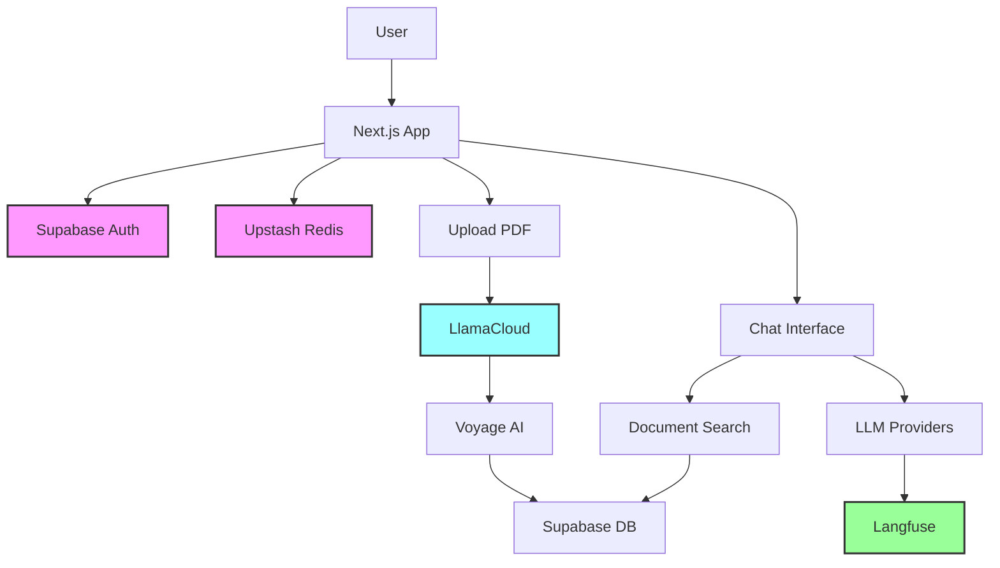

# 🔧 External Services Overview

This document provides a comprehensive overview of all external services used in the SupabaseAuthWithSSR template, their purposes, costs, and how they integrate into the application.

## 📋 Table of Contents

1. [Service Summary](#service-summary)
2. [Core Services](#core-services)
   - [Supabase](#1-supabase---authentication--database)
   - [Upstash Redis](#2-upstash-redis---rate-limiting--caching)
3. [AI & Processing Services](#ai--processing-services)
   - [LlamaCloud](#3-llamacloud---pdf-processing)
   - [Voyage AI](#4-voyage-ai---embeddings)
4. [LLM Providers](#llm-providers)
   - [OpenAI](#6-openai---gpt-models)
   - [Anthropic](#7-anthropic---claude)
   - [Google AI](#8-google-ai---gemini)
5. [Monitoring & Analytics](#monitoring--analytics)
   - [Langfuse](#9-langfuse---llm-observability)
6. [Cost Summary](#cost-summary)
7. [Service Dependencies](#service-dependencies)

---

## Service Summary

| Service | Purpose | Free Tier | Paid Tier | Critical? |
|---------|---------|-----------|-----------|-----------|
| **Supabase** | Auth & Database | 500MB DB, 1GB storage | $25/mo | ✅ Essential |
| **Upstash Redis** | Rate Limiting | 10K commands/day | $0.2/100K | ✅ Essential |
| **LlamaCloud** | PDF Processing | 10K credits/mo | $50/mo | ✅ Essential |
| **Voyage AI** | Embeddings | Limited | Pay-per-use | ✅ Essential |
| **OpenAI** | GPT Models | None | Pay-per-use | ⚡ Optional |
| **Anthropic** | Claude | None | Pay-per-use | ⚡ Optional |
| **Google AI** | Gemini | Free tier | Pay-per-use | ⚡ Optional |
| **Langfuse** | Monitoring | Generous free | $49/mo | 📊 Recommended |

---

## Core Services

### 1. Supabase - Authentication & Database

**Purpose**: Core infrastructure for authentication, database, and file storage.

**What it does**:
- 🔐 **Authentication**: User signup/login with email, Google OAuth
- 💾 **Database**: PostgreSQL with pgvector extension for embeddings
- 📁 **File Storage**: Stores uploaded PDFs in `userfiles` bucket
- 🔒 **Row Level Security**: Ensures users only access their own data

**Implementation**:
```typescript
// Authentication
const session = await getSession();

// Database operations
const { data, error } = await supabase
  .from('user_documents')
  .select('*')
  .eq('user_id', userId);

// File storage
const { data } = await supabase.storage
  .from('userfiles')
  .upload(path, file);
```

**Cost Considerations**:
- Free tier: 500MB database, 1GB storage, 50K monthly active users
- Pro tier ($25/mo): 8GB database, 100GB storage, 100K MAU
- **pgvector storage**: ~255KB per document (includes embeddings)

---

### 2. Upstash Redis - Rate Limiting & Caching

**Purpose**: Implements rate limiting to prevent API abuse and reduce costs.

**What it does**:
- 🚦 **Rate Limiting**: 30 messages per 24 hours per user
- ⚡ **Caching**: Can cache frequently accessed data
- 🌍 **Global Edge**: Low latency worldwide

**Implementation**:
```typescript
const ratelimit = new Ratelimit({
  redis,
  limiter: Ratelimit.slidingWindow(30, '24h')
});

const { success, limit, reset, remaining } = await ratelimit.limit(
  `ratelimit_${session.id}`
);
```

**Cost Considerations**:
- Free tier: 10,000 commands/day, 256MB storage
- Pay-as-you-go: $0.2 per 100K commands
- **Typical usage**: ~100 commands per user session

---

## AI & Processing Services

### 3. LlamaCloud - PDF Processing

**Purpose**: Converts PDF documents to clean, structured markdown text.

**What it does**:
- 📄 **PDF Parsing**: Extracts text with layout preservation
- 🔤 **OCR Support**: Handles scanned documents
- 📊 **Table Extraction**: Preserves table structures
- 📈 **Chart Recognition**: Describes visual elements

**Implementation**:
```typescript
// 1. Upload PDF to LlamaCloud
const uploadResponse = await fetch(
  'https://api.cloud.llamaindex.ai/api/v1/parsing/upload',
  {
    headers: { Authorization: `Bearer ${LLAMA_CLOUD_API_KEY}` },
    body: formData
  }
);

// 2. Get processed markdown
const markdownResponse = await fetch(
  `https://api.cloud.llamaindex.ai/api/v1/parsing/job/${jobId}/result/markdown`
);
```

**Cost Considerations**:
- Free tier: 10,000 credits/month
- Pro tier ($50/mo): 33,000 credits/month
- **Credit usage**: ~10 credits per PDF page
- **NOT using indexes**: Only using parsing feature

---

### 4. Voyage AI - Embeddings

**Purpose**: Generates high-quality vector embeddings for semantic search.

**What it does**:
- 🧮 **Text Embeddings**: Converts text to 1024-dimensional vectors
- 🎯 **Semantic Search**: Enables similarity-based document retrieval
- 🚀 **High Performance**: Optimized for accuracy and speed

**Implementation**:
```typescript
const embeddingModel = voyage.textEmbeddingModel('voyage-3-large', {
  inputType: 'document',
  truncation: false,
  outputDimension: 1024,
  outputDtype: 'int8'
});

const { embedding } = await embed({
  model: embeddingModel,
  value: combinedContent
});
```

**Cost Considerations**:
- Pay-per-use model
- **voyage-3-large**: ~$0.12 per million tokens
- **Average document**: ~1,000 tokens = $0.00012

---

## LLM Providers

### 5. OpenAI - GPT Models

**Available Models**:
- `gpt-4.1-2025-04-14`: Latest GPT-4.1
- `gpt-4.1-mini`: Cheaper, faster variant
- `o3-2025-04-16`: Advanced reasoning model

**Cost**: Pay-per-token (no free tier)

---

### 6. Anthropic - Claude

**Available Models**:
- `claude-3-7-sonnet-20250219`: Latest Claude with thinking capability

**Special Features**:
```typescript
providerOptions.anthropic = {
  thinking: { type: 'enabled', budgetTokens: 12000 }
}
```

**Cost**: Pay-per-token (no free tier)

---

### 7. Google AI - Gemini

**Available Models**:
- `gemini-2.5-pro-preview-03-25`: Advanced model
- `gemini-2.5-flash-preview-04-17`: Fast, efficient model

**Used For**:
- Chat conversations (optional)

**Cost**: Generous free tier, then pay-per-use

---

## Monitoring & Analytics

### 8. Langfuse - LLM Observability

**Purpose**: Monitors and analyzes AI chat interactions.

**What it tracks**:
- 📊 **Token Usage**: Input/output tokens per request
- 💰 **Cost Tracking**: Real-time cost calculation
- 📈 **Performance**: Response times, error rates
- 🔧 **Tool Usage**: Which tools are called
- 👤 **User Analytics**: Usage patterns per user

**Implementation**:
```typescript
experimental_telemetry: {
  isEnabled: true,
  functionId: 'api_chat',
  metadata: {
    userId: session.id,
    chatId: chatSessionId
  },
  recordInputs: true,
  recordOutputs: true
}
```

**What's NOT tracked**:
- ❌ LlamaCloud PDF processing costs
- ❌ Voyage AI embedding costs
- ❌ Document upload metrics
- ❌ Storage usage

**Cost Considerations**:
- Free tier: Very generous for small projects
- Team plan ($49/mo): Advanced features

---

## Cost Summary

### Minimum Monthly Cost (Free Tiers)
- **Total**: $0/month
- **Limitations**: 
  - 10-20 PDF uploads/day
  - 30 chats/user/day
  - Basic monitoring

### Typical Small Project (Mixed)
- **Supabase Pro**: $25/mo
- **Others**: Free tiers
- **Total**: ~$25-30/mo

### Production Scale
- **Supabase Pro**: $25/mo
- **LlamaCloud Pro**: $50/mo
- **Langfuse Team**: $49/mo
- **LLM costs**: Variable ($50-200/mo)
- **Total**: ~$175-375/mo

---

## Service Dependencies



### Critical Path Services
1. **Supabase**: Core infrastructure (auth, database, storage)
2. **Upstash Redis**: Rate limiting (prevents cost overruns)
3. **LlamaCloud**: PDF processing (core feature)
4. **Voyage AI**: Embeddings (enables search)

### Optional Enhancements
1. **Multiple LLMs**: Choice is good but one is enough
2. **Langfuse**: Monitoring (highly recommended but not blocking)

---

## Quick Setup Priority

1. **First** (Required to run):
   - Supabase (auth & database)
   - Upstash Redis (rate limiting)
   - At least one LLM API key

2. **Second** (Core features):
   - LlamaCloud (PDF processing)
   - Voyage AI (embeddings)

3. **Third** (Enhanced experience):
   - Additional LLM providers
   - Langfuse (monitoring) 